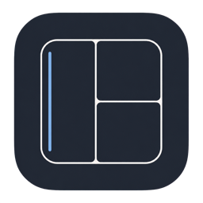
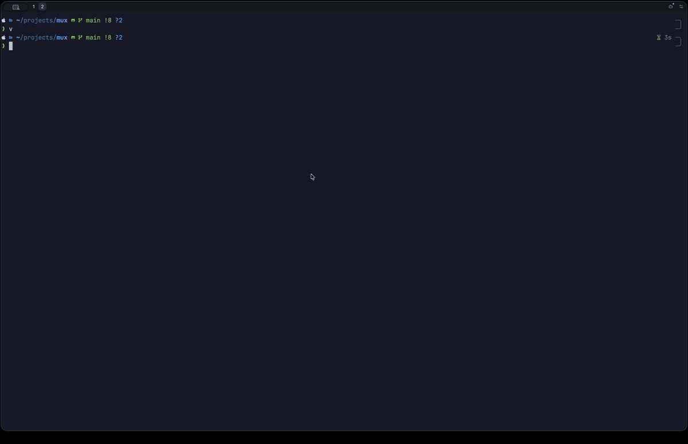

<p align="center">
  
</p>

<h1 align="center">Mux</h1>

<p align="center">
  A native terminal workspace with Ghostty-powered terminals,<br>
  persistent Zellij-style panes, and first-class ACP agents.
</p>

<p align="center">
  <a href="#install">Install</a> ·
  <a href="docs/keybindings.md">Keybindings</a> ·
  <a href="docs/architecture.md">Architecture</a> ·
  <a href="CONTRIBUTING.md">Contributing</a>
</p>

<p align="center">
  
</p>

## What is Mux?

Mux is a terminal application for macOS—not a TUI running inside another
terminal. It combines native [GPUI](https://www.gpui.rs/) rendering,
[libghostty](https://github.com/ghostty-org/ghostty) terminal emulation, and the
small part of Zellij that matters most: panes, tabs, sessions, and familiar
modal keybindings.

A background daemon owns every PTY. Close the window, reopen Mux, and the
shells and programs in your workspace are still running.

Coding agents are part of the workspace too. Mux is an
[Agent Client Protocol](https://agentclientprotocol.com/) client, so Codex and
other ACP-compatible agents can run in native panes with the working directory
and terminal context of the current tab—without turning the terminal into an
IDE.

## Highlights

- Real, independent PTYs in every pane
- Persistent tabs, panes, shells, and agent sessions
- Ghostty-owned terminal parsing, scrollback, input, selection, and mouse modes
- Zellij-style keyboard control that stays out of Vim and shell input
- Codex, Claude Agent, Gemini CLI, and GitHub Copilot CLI through ACP
- Native, GPU-rendered macOS interface with minimal permanent chrome

## Install

Mux currently targets macOS. Download the Apple Silicon or Intel build from
[the latest release](https://github.com/r-firth/mux/releases/latest), unzip it,
and move `Mux.app` to Applications.

To build the current source, install the Xcode command-line tools and clone the
repository. The build script fetches the pinned Zig 0.16.0 toolchain when
needed:

```sh
git clone https://github.com/r-firth/mux.git
cd mux
MUX_ZIG="$(scripts/install-zig-macos.sh)" scripts/bundle-macos.sh
open target/Mux.app
```

Mux discovers or starts its per-user daemon automatically. Closing the GUI
does not stop its shells.

## Keyboard first

| Keys | Action |
| --- | --- |
| `Ctrl+p`, `d` | Split down |
| `Ctrl+p`, `r` | Split right |
| `Ctrl+p`, `a` | Turn the focused pane into an agent pane |
| `Ctrl+t`, `n` | Create a tab |
| `Option` + arrows | Move between panes and across tab edges |
| `Ctrl+p`, `f` | Zoom the focused pane |
| `Ctrl+p`, `x` | Close the focused pane |

Everything else reaches the foreground program normally. See the
[complete keybinding reference](docs/keybindings.md) for pane, resize, tab,
session, and agent controls.

## Native agents

Press `Ctrl+p`, then `a` to turn the focused terminal pane into its tab-local
agent surface. The composer is keyboard-first: Return sends, Shift+Return adds
a line, `/` opens local and agent-advertised command completion, and `@` finds
files from the pane's live working directory. Prompts include bounded snapshots
of the other terminal panes in that tab by default; `/context none` disables
that for subsequent prompts.

`/new` starts another agent session in the same tab. Option+Left/Right moves
through those sessions, then continues into neighboring terminal panes or tabs
at the edge. `Ctrl+a` returns the pane to its terminal without ending the agent,
Escape cancels a running turn, and `/end` ends the selected agent session.

Mux includes launch profiles for Codex, Claude Agent, Gemini CLI, and GitHub
Copilot CLI. Custom ACP agents use the same `agent_servers` shape as Zed. Add an
entry to `~/Library/Application Support/io.mux.Mux/settings.json`, then restart
Mux:

```json
{
  "agent_servers": {
    "my-agent": {
      "type": "custom",
      "command": "/absolute/path/to/my-agent",
      "args": ["--acp"],
      "env": { "OPTIONAL_VARIABLE": "value" }
    }
  }
}
```

The command must be an ACP server that communicates over standard input and
output. Custom profiles appear alongside the built-ins in Settings and work
with `/new my-agent [cwd]`.

## Development

The workspace uses the Rust toolchain pinned in `rust-toolchain.toml`.

```sh
cargo fmt --check
cargo test --workspace --all-targets
cargo clippy --workspace --all-targets -- -D warnings
```

Product builds and native terminal tests also require the pinned Zig toolchain.
See [CONTRIBUTING.md](CONTRIBUTING.md) for the complete checks and release
workflow.

## License

[Apache 2.0](LICENSE)
